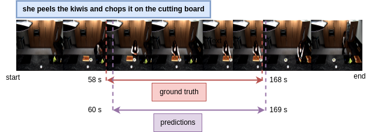

# natural_language_video_grounding
Retrieve the moment(start and end timestamp) from the video given sentence query.
It is the replication of the architecture from original paper 
[link](https://openaccess.thecvf.com/content/CVPR2021/papers/Zhang_Multi-Stage_Aggregated_Transformer_Network_for_Temporal_Language_Localization_in_Videos_CVPR_2021_paper.pdf) and original [code](https://github.com/mxingzhang90/MSAT).

#### Training
Use the following commands for training:
```
# For ActivityNet Captions
python moment_localization/train.py --cfg experiments/activitynet/MSAT-32.yaml --verbose

# For TACoS
python moment_localization/train.py --cfg experiments/tacos/MSAT-128.yaml --verbose
```
#### Inference
Use the following commands for inference:
```
# For TACoS
python moment_localization/inference.py --cfg experiments/tacos/MSAT-128.yaml --verbose
```


## Demo


